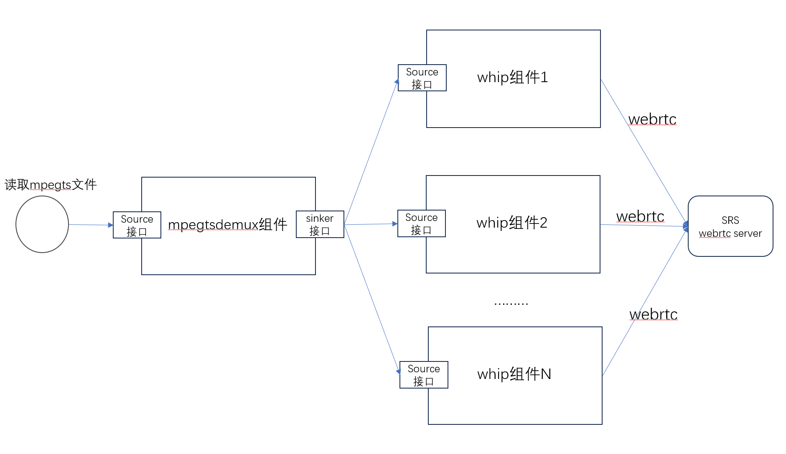

# Read the mpegts file to do whip streaming bench stress test development example
## 1 Introduction
cpp streamer is an audio and video component that provides streaming development mode.

The implementation of reading mpegts files for whip (webrtc ingest http protocol) push streaming uses two components:
* mpegtsdemux component
* whip component

The stress test starts multiple whip component instances to push streams concurrently. The concurrency mode adopts libuv's single-threaded asynchronous high-concurrency mode.

The whip push stream of webrtc implemented in this example, the https path and server are implemented for the webrtc service of srs, and the whip protocol is [webrtc ingest http protocol](https://www.ietf.org/archive/id/draft- ietf-wish-whip-08.txt), the whip in this example matches the http subpath path of srs.

The implementation is as shown below



* Read the mpegts file first
* Use the mpegtsdemux component: the source interface imports the file binary stream, and after parsing, outputs the video + audio media stream through the sinker interface;
* Using whip component: After the source interface imports the upstream parsed media stream, the component encapsulates the webrtc network transmission format, and then sends it to the webrtc server through the network, here is the webrtc service of srs.
* Start multiple whip component instances and push to webrtc service at the same time;

### 1.1 Whip url format of srs
```
http://10.0.24.12:1985/rtc/v1/whip/?app=live&stream=1000
```
As above:

http method: post

http subpath: /rtc/v1/whip/

http parameters: app=live&stream=1000, note that both app and stream parameters are required

### 1.2 Execute command line
```
./whip_srs_bench -i xxxx.ts -o "http://10.0.24.12:1985/rtc/v1/whip/?app=live&stream=1000" -n 100
```

Notice:
* The output address group must be enclosed in quotation marks.
* -n is the number of concurrent whip sessions
* mpegts file, the encoding format must be: video h264 baseline; audio opus sampling rate 48000, number of channels is 2;

Recommended ffmpeg command line to generate mpegts source files:
```
ffmpeg -i src.mp4 -c:v libx264 -r 25 -g 100 -profile baseline -c:a libopus -ar 48000 -ac 2 -ab 32k -f mpegts webrtc.ts
```

## 2. Code development and implementation
The code is implemented in: [src/tools/whip_srs_bench.cpp](../src/tools/whip_srs_bench.cpp)

### 2.1 Introduction to cpp streamer component interface
Each media component is accessed using an interface class, as follows:
```
class CppStreamerInterface
{
public:
     virtual std::string StreamerName() = 0;
     virtual void SetLogger(Logger* logger) = 0;
     virtual int AddSinker(CppStreamerInterface* sinker) = 0;
     virtual int RemoveSinker(const std::string& name) = 0;
     virtual int SourceData(Media_Packet_Ptr pkt_ptr) = 0;
     virtual void StartNetwork(const std::string& url, void* loop_handle) = 0;
     virtual void AddOption(const std::string& key, const std::string& value) = 0;
     virtual void SetReporter(StreamerReport* reporter) = 0;
};
```
* StreamerName: Returns a string, the unique component name
* SetLogger: Set log output. If not set, no log will be generated inside the component;
* AddSinker: Add the next hop interface of component output;
* RemoveSinker: Delete the next hop interface output by the component;
* SourceData: The interface through which the component accepts data from the previous hop;
* StartNetwork: If it is a network component, such as rtmp, webrtc whip, you need to enter the url to start the operation of the network protocol;
* AddOption: Set specific options;
* SetReporter: Set the interface for component reporting messages, such as component internal error information, or network component transmission media stream bitrate, frame rate and other information;

# 2.2 Create components
Create component code, [detailed code whip_srs_bench.cpp](../src/tools/whip_srs_bench.cpp)
```
class Mpegts2Whips: public StreamerReport, public TimerInterface
{
     int MakeStreamers() {
         CppStreamerFactory::SetLogger(s_logger);//Set log output
         CppStreamerFactory::SetLibPath("./output/lib");//Set the path of the component dynamic library

         tsdemux_streamer_ = CppStreamerFactory::MakeStreamer("mpegtsdemux");//Create mpegtsdemux component
         tsdemux_streamer_->SetLogger(logger_);//Set module log output
         tsdemux_streamer_->AddOption("re", "true");//Set flv's demux to parse and output according to the timestamp of the media stream
         tsdemux_streamer_->SetReporter(this);//Set message report
 
         //Create multiple whip stress test instances
         for (size_t i = 0; i < bench_count_; i++) {
             CppStreamerInterface* whip_streamer = CppStreamerFactory::MakeStreamer("whip");//Create whip component
             whip_streamer->SetLogger(logger_);//Set module log output
             whip_streamer->SetReporter(this);//Set message report
             tsdemux_streamer_->AddSinker(whip_streamer);//Set the next hop of the mpegtsdemux component to the whip component

             whips_.push_back(whip_streamer);
         }

         return 0;
     }

     //Start the timer and start several whip instances each time
     void StartWhips() {
         size_t i = 0;
         for (i = whip_index_; i < whip_index_ + WHIPS_INTERVAL;i++) {
             if (i >= bench_count_) {
                 break;
             }
             std::string url = GetUrl(i);

             whips_[i]->StartNetwork(url, loop_);//Set the whip destination url and libuv network loop handle, and start the whip session.
         }
         whip_index_ = i;
         if (whip_index_ >= bench_count_) {
             post_done_ = true;
         }
     }
}
```

# 2.3 mpegts file input
File reading:
```
         uint8_t read_data[10*188];
         size_t read_n = 0;
         do {
             read_n = fread(read_data, 1, sizeof(read_data), file_p);
             if (read_n > 0) {
                 InputTsData(read_data, read_n);
             }
             if (!whip_ready_) {
                 LogErrorf(logger_, "whip error and break mpegts reading");
                 break;
             }
         } while (read_n > 0);
```
The file is input through the sourceData interface of the mpegtsdemux component:
```
     int InputTsData(uint8_t* data, size_t data_len) {
         Media_Packet_Ptr pkt_ptr = std::make_shared<Media_Packet>();
         pkt_ptr->buffer_ptr_->AppendData((char*)data, data_len);
         tsdemux_streamer_->SourceData(pkt_ptr);
         return 0;
     }
```